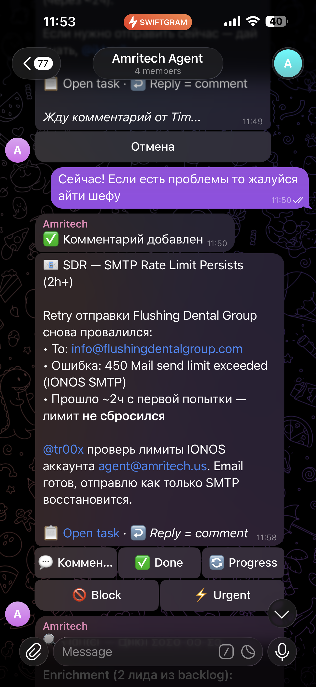
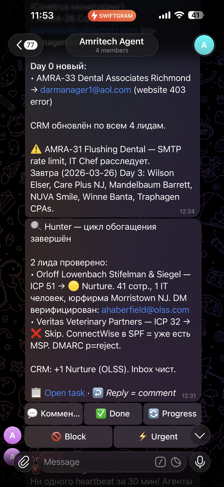
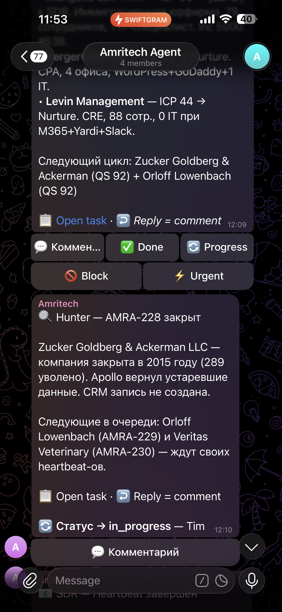
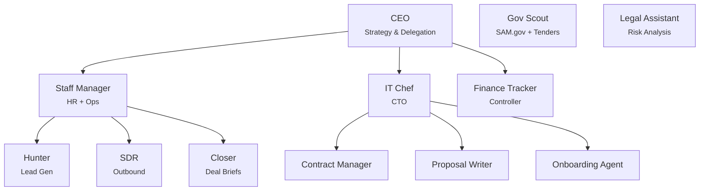
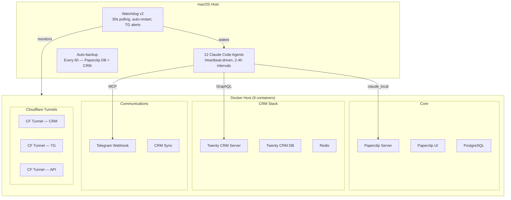

<p align="center">
  
</p>

<h1 align="center">AmriTech AI HQ — A Real-World AI Company Running on Paperclip</h1>

<p align="center">
  <strong>12 autonomous AI agents. 9 Docker containers. 80+ commits of battle-tested config. Zero hand-holding.</strong><br/>
  <sub>A production-grade setup for running an MSP business with 3 humans and an AI army.</sub>
</p>

<p align="center">
  <a href="https://github.com/paperclipai/paperclip"></a>
  <a href="https://github.com/tr00x/paperclip/blob/opensource/LICENSE"></a>
  <a href="https://github.com/tr00x/paperclip/stargazers"></a>
</p>

<br/>

## The Story

I built this over weeks of sleepless nights. An entire AI-powered headquarters for a managed IT services company — lead generation, sales outreach, contract management, government tenders, client onboarding, finance tracking — all running autonomously on scheduled heartbeats.

12 agents. A self-healing watchdog. CRM integration. Telegram bot with inline menus. Voice messages via Whisper. Branded HTML email templates. Auto-backups every 6 hours. Cloudflare tunnels for remote access. A full approval protocol so agents can't go rogue.

**Then my team never used it.**

So I'm open-sourcing the whole thing. Every agent config. Every skill. Every Docker setup. The self-healing watchdog. The CRM integration. All of it.

If this resonates with you — if you've ever wanted to see what a fully autonomous AI company actually looks like in production — here it is. No toy demos, no "coming soon." This ran real operations.

**If this helped you or inspired you, drop a star. I'll keep building ready-made HQ packs for different industries.**

> **Important:** This runs entirely on **`claude_local`** adapter — just Claude Code CLI on your machine. No OpenClaw, no cloud agents, no external orchestration runtime. Pure Claude Code + Paperclip + Docker.

<br/>

## Screenshots — Real Production Telegram Bot

> **Note:** Screenshots are in Russian — that's how we used it in production. The entire system is fully customizable to any language via the Claude Code customization prompt below.

<p align="center">
  
</p>
<p align="center"><sub>Main menu — 12 AI agents on duty 24/7. Message Agent, CRM, Sales, Tasks, Approvals, Errors — all from your phone.</sub></p>

<p align="center">
  
  &nbsp;&nbsp;
  
</p>
<p align="center"><sub>Left: SDR reporting SMTP rate limit with auto-retry. Right: Hunter enrichment cycle — ICP scoring, DM verification, CRM updates.</sub></p>

<p align="center">
  
  &nbsp;&nbsp;
  
</p>
<p align="center"><sub>Left: Hunter closing stale leads + enrichment queue. Right: Watchdog self-healing — Docker restart loops detected, tunnels restarted automatically.</sub></p>

<br/>

## What's Inside

This is a complete [Paperclip](https://github.com/paperclipai/paperclip) company deployment — a real org chart of AI agents that ran an MSP (Managed Service Provider) business targeting SMBs in the NYC/NJ/PA area.

### The Agents



| Agent | Role | What It Actually Does |
|-------|------|----------------------|
| **CEO** | Strategy & Delegation | Reviews KPIs, prioritizes pipeline, delegates to the team, reports to founders. Daily strategist reboot — not an empty coordinator. |
| **Hunter** | Lead Generation | Scrapes job boards, LinkedIn, NPI registries, Apollo.io — finds companies with bad IT. Search cache, enrichment queue, real pain signal scoring. |
| **SDR** | Outbound Sales | Sends personalized cold emails via SMTP with branded HTML templates. SMTP throttle (30s between sends, 10 max per heartbeat) to protect deliverability. |
| **Closer** | Deal Strategy | Prepares call briefs with competitor intel, pricing recommendations, objection handling for one-call closes. |
| **Staff Manager** | HR & Operations | Monitors all agents, flags issues, manages the AI org chart. Enforces accountability — agents delegate via tasks, demand from humans. |
| **IT Chef** | CTO / Engineering | Promoted to full CTO — autonomous authority, no human dependency. Self-heals infrastructure, deploys fixes, manages Docker containers. Edits its own TOOLS.md. |
| **Finance Tracker** | Controller | Tracks invoices, renewals, MRR, alerts on payment gaps. |
| **Contract Manager** | Legal Ops | Watches contract expirations, renewal deadlines, compliance. |
| **Proposal Writer** | Document Gen | Creates SOWs, proposals, NDAs from Word templates per deal context. |
| **Onboarding Agent** | Client Success | Sends branded welcome packages, schedules kickoffs when deals close. |
| **Gov Scout** | Government Sales | Monitors SAM.gov and state portals for IT tenders. Custom scoring criteria. |
| **Legal Assistant** | Risk Analysis | Reviews contracts for red flags, advises on liability. Conservative by design. |

<br/>

### Technical Deep Dive

This isn't a weekend project. Here's what went into making it actually work.

---

#### Telegram Bot — Mobile Command Center (2,200+ lines)

The bot is split into two servers: a **webhook receiver** (all business logic, menus, CRM queries — 2,263 lines) and an **MCP tool provider** (minimal send interface for agents). This separation means agents send messages through MCP, but all interactive logic lives in the webhook handler.

**Single-Message UX:**
The entire menu system edits ONE message in-place. No chat spam. The `editOrSend()` function tries three strategies in order: edit caption (preserves logo photo) → edit text → delete + resend. Every menu navigation, CRM query, and status check updates the same message.

**CRM Live Inside Telegram:**
10 different CRM views accessible via buttons — hot leads (70+ score), pipeline by status, outreach stats, nurture list, lost deals, tenders, clients. Each view supports pagination (10 items per page) with Previous/Next buttons. All data fetched live via GraphQL from Twenty CRM on every button press. Lead detail cards show full info with action buttons: "Send Email" (creates SDR task), "Log Call", "Change Status".

**Pending State Machine:**
When you tap an agent button, the bot doesn't create a task immediately. It enters a "pending" state — persisted to `/tmp/tg-pending-state.json` with a 10-minute auto-expiry. Your next text message becomes the task description for that agent. Same pattern for comments, status updates, and search queries. `/commands` cancel pending state.

**Voice → Agent Pipeline:**
Voice messages get downloaded, transcribed via Whisper (base model — tiny produced empty transcripts, that was a fun debug session), and the transcript becomes a task description routed to the pending agent. If transcription fails, it falls back to file attachment. Files go to `/tmp/amritech-tg-files/` with timestamp naming, and the absolute path is included in the task so agents can read it directly.

**Role-Based Button Presets:**
Three specialized button sets beyond the standard [Comment/Done/Block/Urgent]:
- `ceo_decision` — CEO lead approval: [Yes, call them! / Skip]
- `account_mgr_call` — Account manager call tracking: [Called — writing result / Didn't reach / Client agreed! / Rejected]
- `ceo_pricing` — Pricing approval: [Pricing ready — call them / Question about pricing]

**Team-Only Access:**
Username whitelist checked on every callback and message. Non-team members get silently ignored (200 OK, no error — invisible to outsiders). Optional chat ID enforcement for group-only operation.

**Dedup Strategy:**
Messages and callbacks are deduplicated to prevent double-processing from Telegram's webhook retries. But menu navigation and CRM pagination are explicitly excluded from dedup — users navigate fast and expect instant response.

---

#### Watchdog v2 — Self-Healing Daemon

A bash script running via macOS launchd (`KeepAlive: true`) that polls every 30 seconds. 10MB rolling logs. Zero external dependencies — it can recover the entire stack even when I'm sleeping.

**What It Monitors (10 Health Checks):**

| Check | Detection | Recovery | Time |
|-------|-----------|----------|------|
| Docker Desktop | `docker info` fails | `open -a Docker`, wait 2min | ~120s |
| Paperclip Server | HTTP 200 missing on `:4444/api/health` | `pkill` + `pnpm dev:once` | ~60s |
| Stale DB State | SQL query for stuck agents/runs | Direct PG mutations (reset status, unlock tasks) | <10s |
| Twenty CRM | Container not running | `docker compose up -d` | ~15s |
| Telegram Webhook | Port 3088 not listening | Restart Node.js with full env | ~2s |
| CRM Sync | Port 3089 not listening | Same pattern | ~2s |
| Cloudflare Tunnels (x3) | PID alive but HTTP probe fails | Kill orphan + restart `cloudflared` | ~4s |
| Backend Code Changes | `restartRequired` flag in health response | Drain active runs (5min max), then restart | 0-5min |
| Hung Runs | SQL: runs stuck >35 minutes | Mark error, reset agent, unlock issues | <5s |
| Agent Overdue | Heartbeat >2x interval | POST `/api/agents/{id}/wakeup` | Every 5 cycles |

**The `dev:once` Decision:**
Original setup used `tsx watch` (file watcher). Problem: every file change restarted the server, which killed all running agent processes mid-heartbeat. Replaced with `dev:once` — single start, no watcher. Watchdog handles restarts when actually needed.

**Direct SQL Mutations:**
When Paperclip crashes mid-heartbeat, agents get stuck in `running` state with locked tasks. The watchdog runs a Node.js script that connects directly to embedded Postgres and:
- Clears `heartbeat_runs` stuck >5 minutes → status `error`
- Resets agents in `error`/`failed` state → `idle`
- Unlocks issues locked by dead runs (clears `checkout_run_id`, `execution_locked_at`)
- Clears queued runs >10 minutes old

No ORM, no API — raw SQL for speed and reliability when the server is down.

**Sleep Prevention:**
Runs `caffeinate -si` via launchd to prevent Mac from sleeping on AC power. Because your AI company shouldn't stop working because your laptop lid closed.

---

#### CRM Integration — Role-Based MCP with GraphQL

The Twenty CRM MCP server implements **dynamic tool gating** — each agent gets only the CRM operations it needs:

```
Hunter:           create_lead, search_leads, update_lead, create_company, search_companies
SDR:              get_lead, search_leads, update_lead, get_contact
Closer:           get_lead, get_company, get_contact, list_pipeline, update_lead
CEO:              search_leads, pipeline_stats, search_companies
Gov Scout:        create_tender, search_tenders, create_company, search_companies
Finance Tracker:  search_invoices, create_invoice, update_invoice, get_client
Contract Mgr:     search_clients, get_client, update_client
```

Server spawns with `--role=<agent>` flag. Only whitelisted tools get registered with the MCP runtime — others exist in code but are unreachable. This prevents accidental mutations (SDR can't delete leads, Hunter can't touch invoices).

**Pipeline State Machine:**
```
New → Contacted → Replied → Meeting → Proposal → Closed Won / Closed Lost
                                                         ↓
                                                      Nurture (re-score in 30 days)
```

**Outreach Status Tracking (SDR-specific):**
```
email_sent → follow_up_1 → follow_up_2 → replied_interested / cold / not_interested / no_response
```

Every status change gets a timestamped note in CRM. Every agent action requires a CRM update — work without a CRM record doesn't count as done.

---

#### SHARED-PROTOCOL.md — Corporate Culture for AI Agents

Instead of copy-pasting the same rules into every agent, we have one file — `SHARED-PROTOCOL.md` — that defines company-wide behavior. Think of it as your AI company's employee handbook. Every agent reads it on boot. It covers:

- How to check in and check out tasks (no double work)
- When to shut up and exit early (save tokens when idle)
- How to report in Telegram (what to say, what not to say)
- Approval gates (what needs human sign-off)
- How to handle conflicts (409 = someone was faster, move on)
- Memory protocol (what to remember, what to forget)
- Demand escalation (how to push humans to act)

This means you change behavior for ALL agents in one place. New rule? Edit one file. New escalation policy? One file. New approval gate? One file. No agent gets left behind.

#### Coordination Sequence (from SHARED-PROTOCOL.md)

Every agent follows the same sequence on each heartbeat:

```
1. GET /api/agents/me          → Confirm identity, check budget (>80% = critical tasks only)
2. GET /api/agents/me/inbox-lite → Check for assigned tasks
   └─ If WAKE_COMMENT_ID set  → Read the comment first (may contain urgent context)
3. Early Exit Check            → No tasks + no wake trigger = EXIT silently (save tokens)
4. POST /api/issues/{id}/checkout → Lock task with optimistic concurrency
   └─ 409 Conflict = another agent was faster → skip, no retry
5. Do the work
6. Update CRM + Comment on task + Report in Telegram
7. X-Paperclip-Run-Id header on all mutations → idempotency across replays
```

**The Demand System:**
Agents don't politely suggest. They file demands with deadlines and escalation cascades:
```
0-2h:  Normal notification
2h:    "@founder — {company} replied 2 hours ago. Decision needed."
4-8h:  "Warning: lead going cold. No response in {N} hours."
8h+:   "URGENT: @founder @cto — {company} waiting {N} hours, no decision!"
```
Dedup logic: demand tier is recorded in CRM notes (`DEMAND_TIER:2 sent at {datetime}`) — same tier won't fire twice.

**Approval Gates:**
Mandatory approval required for: first email to new lead, proposals to clients, new agent hires, any spend >$500. Approval request goes to Paperclip API + Telegram buttons. No workaround, no override.

---

#### Lead Intelligence Engine (Hunter)

**Three-Dimensional ICP Scoring:**
```
ICP Score = (Fit × 0.40) + (Tech × 0.30) + (Intent × 0.30)
```

Each dimension scores 0-100 independently:

**Fit** — Is this a good target?
- Employees: Sweet spot 20-100 (score 100), 100-200 (75), 10-20 (50), 200-500 (25)
- Industry: Law/Medical/Dental = 100. CRE/Accounting = 75. Restaurant/Retail = 0.
- Geography: Brooklyn/Manhattan/JC = 100. NYC boroughs = 75. Outside tri-state = 0.

**Tech** — Are they in pain?
- No MSP + in-house IT complaints = 100
- Unreliable break-fix guy = 85
- Strong happy MSP = 0 (auto-skip)

**Intent** — Are they buying now?
- "Replace IT provider" in job posting = 100
- Hiring IT helpdesk = 80
- Data breach in news = 75
- Glassdoor "slow computers" complaints = 60
- New office/expansion = 50

**Free Recon Script** (zero tokens, no API calls):
```bash
recon.sh domain.com → SSL expiry, DMARC/SPF records, WordPress version, HTTP vs HTTPS
```
Each finding adds +5 to +20 to the score. Expired SSL + missing DMARC + old WordPress = easy +45 points before any paid enrichment.

**Score Routing:**
| Score | Action | SLA |
|-------|--------|-----|
| 80-100 [HOT] | CEO task, urgent alert | 4 hours |
| 60-79 [LEAD] | SDR outreach task | 24 hours |
| 40-59 Nurture | CRM only, re-score in 30 days | Monthly |
| <40 Skip | Do not pursue | Archive |

---

#### SDR Email System — Throttled, Templated, Tracked

**Rate Limiting (Learned the Hard Way):**
IONOS SMTP returns 450 errors after too many sends. Solution: 30-second minimum gap between sends, max 10 per heartbeat. First 450 on initial email → critical alert to IT Chef. Failed sends logged in CRM with "Queued — SMTP rate limit, next heartbeat."

**4-Touch Email Sequence:**
```
Day 0:  Initial — 3 lines: pain observation + proof + low-friction CTA
Day 3:  Follow-up #1 — completely different angle (industry stat, mini case study)
Day 7:  Follow-up #2 — social proof or final value prop
Day 14: Breakup — gracious close, open door for future
```

Every email uses the branded HTML template (enforced — skill must be loaded before every send). Subject lines: 2-5 words, lowercase, about THEIR situation. Body: 50-100 words max. Zero links, zero images (spam filter bypass).

**Send Window:**
Monday-Thursday, 8:00-10:00 AM ET only. Friday/weekends/evenings → queue in CRM, notify founder, await confirmation. Follow-ups on Day 3/7 auto-send during business hours (pre-approved).

**Reply Classification (7 categories):**
Positive interest (25-35%) → route to Closer immediately, 1-hour response SLA.
Question about pricing → draft answer, route to CEO for approval before sending.
Referral ("talk to our office manager") → create Hunter task with [REFERRAL] tag.
Not interested → gracious close, mark `closed`, remove from sequences. No guilt-tripping.

---

#### IT Chef — The Self-Healing CTO

Not the CTO's assistant. **The CTO's full replacement** when they're offline. Autonomous authority over:
- Restart any Docker container, tunnel, or service
- Fix agent configs (TOOLS.md, MCP configs)
- Unlock stuck tasks >48h
- Clean up CRM data corruption
- Approve agent [IMPROVEMENT] suggestions (non-critical ones)
- Edit its own TOOLS.md (self-modification capability)

Auto-fix playbooks (no human approval needed):
```
Docker service crashed        → docker restart (restart: always handles most)
Paperclip fell                → pkill + pnpm dev:once
CRM Sync stalled              → docker restart crm-sync
Container restart loop        → docker compose up -d --force-recreate
PostgreSQL WAL corrupted      → pg_resetwal (from hard kill)
Task stalled >48h             → API unlock, reset to todo
Disk >80%                     → docker system prune -f, clean logs
```

Escalation to the human CTO only for: SOUL.md changes, new agent hires, customer data deletion, business strategy changes. Everything else — IT Chef handles it.

Every incident gets recorded in a known-issues database with: symptom, root cause, fix, prevention, auto-fixable flag.

---

#### Engineering Decisions That Mattered

| Decision | Why |
|----------|-----|
| **`dev:once` not `dev:watch`** | Watch mode killed agent processes on every file change. Watchdog handles restarts instead. |
| **Hybrid deploy (host + Docker)** | Agents need host MCP servers + API keys. CRM needs persistent Docker volumes. Neither works alone. |
| **Optimistic concurrency (409, no retry)** | If another agent grabs the task, retrying wastes tokens. Move to next task immediately. |
| **Role-based CRM tools** | SDR can't accidentally delete leads. Hunter can't touch invoices. Reduces blast radius. |
| **Three separate Cloudflare tunnels** | One tunnel down ≠ all down. Independent restart cycles. |
| **30-second SMTP throttle** | IONOS rate limits. Learned after 450 errors killed a whole outreach batch. |
| **Pending state with 10-min expiry** | User taps agent, types message — but if they forget, state cleans itself. |
| **SQL direct mutations in watchdog** | When the server is dead, you can't use the API. Raw PG is the only reliable path. |
| **52% token reduction** | Rewrote all agent instructions to be more concise. At 12 agents × 2-4h heartbeats, every token counts. |
| **Mandatory TG reporting** | Silent agents get ignored. Forced Telegram reports create accountability and audit trail. |
| **Demand escalation tiers** | Polite suggestions don't work. Timed demands with escalation actually get humans to act. |

<br/>

### Infrastructure



<br/>

### MCP Servers (Tool Access)

Each agent gets a tailored set of MCP servers — not everyone gets everything:

| MCP Server | Purpose | Used By |
|-----------|---------|---------|
| **Twenty CRM** | Lead/deal management, pipeline ops | Hunter, SDR, Closer, CEO, Staff Mgr |
| **Telegram** | Team notifications, founder alerts, inline menus | All agents |
| **Email (SMTP/IMAP)** | Send/receive branded business emails | SDR, Onboarding, Contract Mgr |
| **Word Docs** | Generate proposals, contracts, NDAs from templates | Proposal Writer, Contract Mgr |
| **Web Search** | Research leads, check domains, competitor intel | Hunter, Gov Scout, Closer |
| **Pandoc** | Document format conversion | Proposal Writer |
| **Apollo.io** | Contact enrichment, company data | Hunter |
| **Serena** | Codebase navigation, self-modification | IT Chef |

<br/>

### Skills (Shared Knowledge)

Skills are injected at runtime — agents load them on demand, not at boot:

| Skill | What It Does |
|-------|-------------|
| `crm-leads` | CRM conventions, lead scoring formula, pipeline stage definitions |
| `html-email` | Branded HTML email template — mobile-optimized, company colors. Enforced on every send. |
| `documents` | SOW/NDA/MSA templates, formatting rules, clause library |
| `team-contacts` | Team directory, escalation paths, who handles what |
| `infra-diagnostics` | Docker troubleshooting runbook, container restart procedures |
| `self-improvement` | Agent self-evaluation protocol — what went well, what to improve |
| `tender-scoring` | Government tender qualification criteria, go/no-go matrix |

<br/>

## Getting Started

### How It Runs

This entire system runs on a **Mac** with a **Claude Max subscription** ($100/mo). That's it.

- **No OpenClaw.** No cloud agents. No external AI runtimes.
- **No per-token API costs.** Claude Max = unlimited usage for all 12 agents.
- **`claude_local` adapter** — Paperclip talks directly to Claude Code CLI on your machine.
- **Docker** handles CRM, Telegram bot, tunnels. **Claude Code** handles all agent intelligence.

**Total cost to run a 12-agent AI company: one Claude Max subscription + whatever your SMTP/domain costs.**

### Prerequisites

- **macOS** (tested on Apple Silicon, should work on Intel)
- [Paperclip](https://github.com/paperclipai/paperclip) installed and running
- Docker & Docker Compose
- [Claude Code CLI](https://docs.anthropic.com/en/docs/claude-code) with an active subscription (Max or Pro)
- A Telegram bot (for notifications + command center)
- SMTP credentials (for outbound email)
- Cloudflare account (for tunnels — optional, for remote access)

### Setup

1. **Clone this repo**
   ```bash
   git clone https://github.com/tr00x/paperclip.git
   cd paperclip
   git checkout opensource
   ```

2. **Copy environment templates**
   ```bash
   cp .env.example .env
   cp docker/amritech/.env.example docker/amritech/.env
   cp twenty-crm/.env.example twenty-crm/.env
   # Edit each .env with your actual credentials
   ```

3. **Start infrastructure**
   ```bash
   cd docker/amritech
   docker-compose up -d
   ```

4. **Register your company in Paperclip**
   ```bash
   pnpm dev
   # Use the UI or CLI to create your company and import the amritech-hq/ config
   ```

5. **Configure MCP servers**
   ```bash
   cd mcp-servers
   # Edit each mcp-*.json with your API keys, tokens, and credentials
   ```

6. **Launch agents**
   ```bash
   # Each agent runs as a Claude Code instance with its own config
   # See amritech-hq/agents/*/HEARTBEAT.md for schedule configs
   ```

<br/>

## Adapting This For Your Business

This HQ was built for an MSP, but the architecture works for any service business:

1. **Fork this repo**
2. **Edit `amritech-hq/COMPANY.md`** — your company goals, team, region
3. **Customize agent SOULs** — each `agents/*/SOUL.md` defines personality and domain knowledge
4. **Adjust HEARTBEAT schedules** — how often each agent wakes up and what it checks
5. **Swap MCP servers** — plug in your CRM, email, tools
6. **Add your skills** — shared knowledge in `skills/` that agents can load at runtime

The agent architecture is modular. Don't need Gov Scout? Delete the folder. Want to add a Support Agent? Create a new directory with SOUL.md, TOOLS.md, and HEARTBEAT.md.

### One-Click Customization with Claude Code

Don't want to edit 50+ config files manually? Open Claude Code in this repo and paste this:

```
I cloned the AmriTech AI HQ template and want to make it mine.

Read amritech-hq/COMPANY.md, amritech-hq/agents/SHARED-PROTOCOL.md, and
amritech-hq/agents/ceo/SOUL.md to understand the current setup.

Then interview me — ask these questions one at a time, wait for my answer
before moving to the next:

1. What's your company name, industry, and location?
2. What do you sell and who's your ideal customer?
3. Who's on your team? For each person: name, role, email, Telegram handle.
4. What's your big goal? (e.g., "$50k MRR by end of year")
5. Which of these agents do you want to keep, remove, or rename?
   CEO, Hunter (lead gen), SDR (outbound email), Closer (deal briefs),
   Staff Manager, IT Chef (CTO), Finance Tracker, Contract Manager,
   Proposal Writer, Onboarding Agent, Gov Scout, Legal Assistant
6. Do you have any agents to ADD? (e.g., Customer Support, Social Media)
7. What's your SMTP provider and credentials?
8. Telegram bot token and chat ID?
9. Do you need Cloudflare tunnels for remote access?
10. Any company rules that ALL agents must follow?
    (These go into SHARED-PROTOCOL.md — your AI employee handbook)

After the interview, update EVERYTHING:
- COMPANY.md (company identity and goals)
- SHARED-PROTOCOL.md (company-wide rules and culture)
- Every agent's SOUL.md (personality adapted to my business)
- Every agent's TOOLS.md (MCP server access)
- Every agent's HEARTBEAT.md (schedules and triggers)
- All .env and .env.example files
- All mcp-servers/mcp-*.json configs
- All skills in amritech-hq/skills/
- Delete agent folders I don't need
- Create new agent folders if I added any
```

Claude Code will interview you, then rewrite every file. Zero technical knowledge required — just answer the questions.

<br/>

## What I Learned

Building a 12-agent autonomous company taught me things no tutorial will:

- **Agents need governance, not freedom.** Without approval gates and budget limits, they will go off the rails. The approval protocol saved us multiple times.
- **Self-healing is non-negotiable.** Agents crash. Containers die. Tunnels drop. The watchdog saved me countless times. If you don't have auto-restart, you don't have a production system.
- **Context is everything.** The SOUL → TOOLS → HEARTBEAT pattern gives agents identity, capability, and rhythm. Without all three, they're just expensive autocomplete.
- **MCP servers are the real power.** Agents without tools are useless. The CRM + Email + Telegram stack is what made this actually functional.
- **Heartbeats > always-on.** Scheduled execution with sleep between beats is cheaper and more reliable than persistent connections. Early exit when idle cuts costs further.
- **Token optimization matters.** We achieved 52% token reduction by rewriting agent instructions. At scale, every token counts.
- **Telegram is the control plane.** Having a mobile command center with inline CRM, agent messaging, and pipeline views means you can run the company from your phone.
- **Agents that can't demand are useless.** Passive agents that "suggest" things get ignored. Ours file demands, set deadlines, and escalate. That's what makes them work.

<br/>

## ClipMart — Coming Soon

Paperclip is building **[ClipMart](https://github.com/paperclipai/paperclip)** — a marketplace where you can download and run entire agent companies with one click. Full org structures, agent configs, skills, and MCP setups — packaged and ready to deploy.

From the [Paperclip roadmap](https://github.com/paperclipai/paperclip):
> - ClipMart — buy and sell entire agent companies
> - Plugin system (already live)
> - Cloud agents (Cursor, e2b)
> - Better docs and easier configurations

**When ClipMart launches, I'll be publishing full HQ packs there** — ready to install, pre-configured, battle-tested. This repo is the first one.

<br/>

## Planned HQ Packs

If stars show interest, I'll build and release these as complete Paperclip company templates:

| Pack | Agents | Status |
|------|--------|--------|
| **MSP / IT Services** (this repo) | CEO, Hunter, SDR, Closer, IT Chef, Staff Mgr, Finance, Contracts, Proposals, Onboarding, Gov Scout, Legal | Done |
| **Marketing Agency** | Content Writer, Social Manager, SEO Analyst, Client Manager, Campaign Tracker | Planned |
| **Dev Shop** | Project Manager, QA Agent, Deployment Bot, Client Liaison, Sprint Planner | Planned |
| **E-commerce** | Inventory Tracker, Customer Support, Review Manager, Pricing Optimizer | Planned |
| **Consulting Firm** | Researcher, Report Writer, Client Manager, Proposal Generator | Planned |
| **Real Estate** | Lead Scraper, Listing Manager, Follow-up Agent, Market Analyst | Planned |

<br/>

## Current State

This repo was published quickly — a raw export from a working production system. The code works, the configs are real, but the packaging isn't polished. If there's interest (stars, forks, issues), I'll clean it up properly — better docs, easier setup, more examples. But for now, I don't see the point of polishing something nobody uses. Prove me wrong.

## Contributing

Found a bug? Want to add a new agent template? PRs welcome.

If you build your own HQ pack — I'd love to feature it here.

<br/>

## Built With

- [Paperclip](https://github.com/paperclipai/paperclip) — open-source orchestration for AI companies
- [Twenty CRM](https://github.com/twentyhq/twenty) — open-source CRM (our pipeline + lead management)
- [Claude Code](https://docs.anthropic.com/en/docs/claude-code) — CLI for Claude (runs all 12 agents via `claude_local`)
- [Cloudflare Tunnels](https://developers.cloudflare.com/cloudflare-one/connections/connect-networks/) — secure HTTPS access without port forwarding
- [Whisper.cpp](https://github.com/ggerganov/whisper.cpp) — local voice transcription for Telegram voice messages
- [Apollo.io](https://www.apollo.io/) — contact enrichment for Hunter lead discovery

## License

MIT — do whatever you want with it.

<br/>

## Star This Repo

If this saved you time, showed you something new, or just made you think "damn, someone actually did this" — **hit the star button**.

Stars = motivation. Let's build this together.

<br/>

---

<p align="center">
  Built with <a href="https://github.com/paperclipai/paperclip">Paperclip</a> and too many sleepless nights.<br/>
  <sub>By <a href="https://github.com/tr00x">@tr00x</a></sub>
</p>