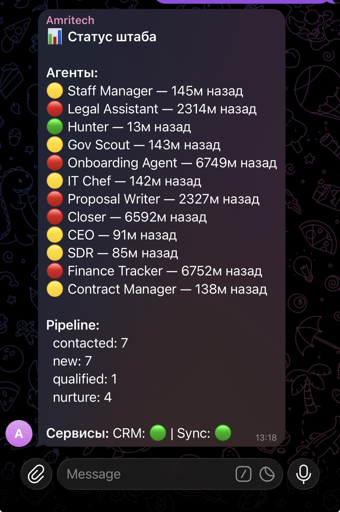
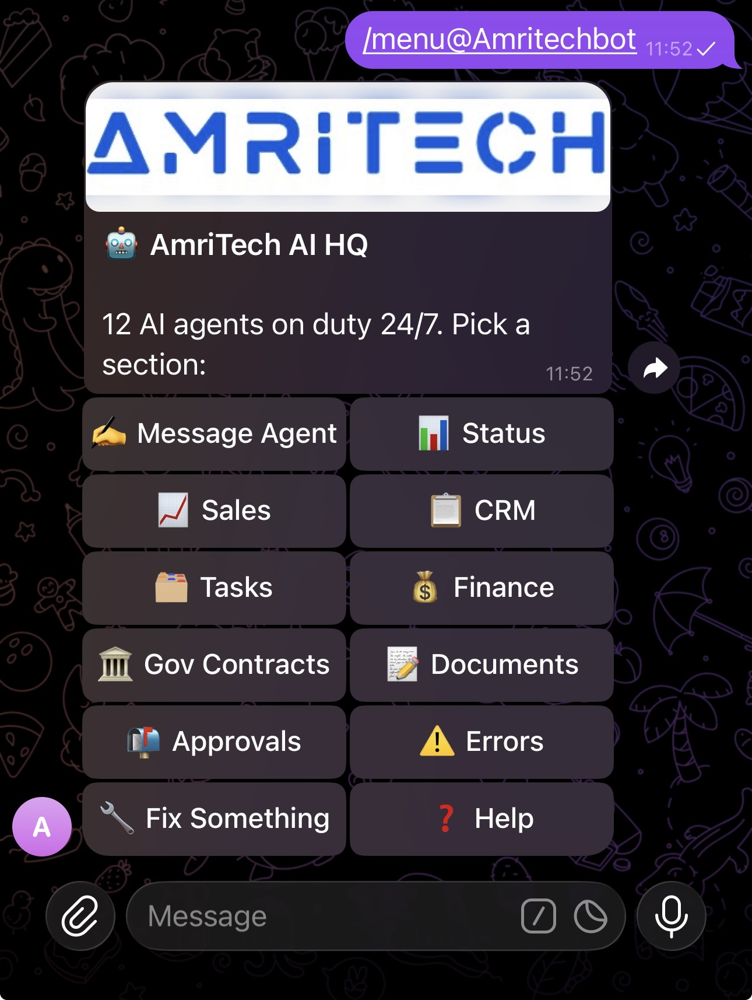
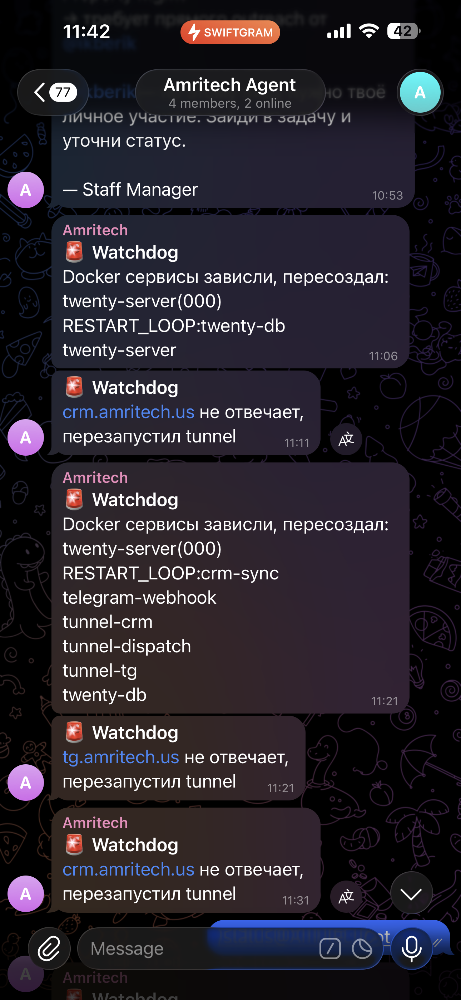
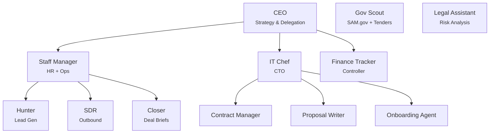
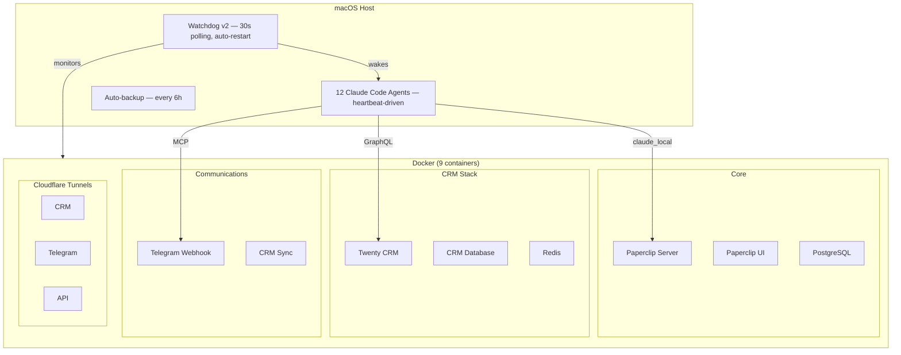

<p align="center">
  
</p>

<h1 align="center">AmriTech AI HQ</h1>

<h3 align="center">A real 12-agent AI company running on Paperclip.<br/>Built for an MSP. Open-sourced for you.</h3>

<p align="center">
  <a href="https://github.com/paperclipai/paperclip"></a>
  <a href="https://github.com/tr00x/paperclip/blob/opensource/LICENSE"></a>
  <a href="https://github.com/tr00x/paperclip/stargazers"></a>
  
  
  
</p>

<p align="center">
  <strong>No OpenClaw. No cloud agents. No per-token API costs.</strong><br/>
  <sub>Just Claude Code CLI + Claude Max subscription + Docker. That's the whole stack.</sub>
</p>

---

## The Story

I built this over weeks of sleepless nights — a full AI-powered HQ for an MSP company. Lead gen, sales outreach, CRM, contracts, onboarding, finance, government tenders. 12 agents running autonomously on heartbeats.

**Then my team never used it.** So here it is. Take it.

---

## Screenshots

> Screenshots are in Russian — that's how we used it. Fully customizable to any language via the [Claude Code prompt below](#one-click-customization-with-claude-code).

| HQ Status (12 agents) | Menu (command center) | Watchdog Alerts |
|:----------------------:|:---------------------:|:---------------:|
|  |  |  |
| Live agent status dashboard | 12 buttons, full control | Self-healing Docker restarts |

| Hunter Enrichment | SDR Outreach | Agent Interaction |
|:-----------------:|:------------:|:-----------------:|
|  |  |  |
| ICP scoring, DM verification | SMTP throttle, sequences | Reply to any agent via Telegram |

---

## What's Inside

A complete [Paperclip](https://github.com/paperclipai/paperclip) company — real org chart, real agents, real configs that ran a real MSP business in NYC/NJ/PA.

| Doc | What's In It |
|-----|-------------|
| [`COMPANY.md`](amritech-hq/COMPANY.md) | Company profile, services, niches, competitive advantages |
| [`DOCUMENTATION.md`](amritech-hq/DOCUMENTATION.md) | Full architecture: tech stack, workflows, CRM schema, Telegram bot, watchdog |
| [`SHARED-PROTOCOL.md`](amritech-hq/agents/SHARED-PROTOCOL.md) | The "employee handbook" — company-wide rules all agents follow |

---

### The 12 Agents



| Agent | What It Does |
|-------|-------------|
| **CEO** | Reviews KPIs, delegates tasks, reports to founders. Daily strategist — not an empty coordinator. |
| **Hunter** | Finds companies with bad IT via job boards, LinkedIn, Apollo.io. ICP scoring 0-100. |
| **SDR** | Cold emails with branded HTML templates. SMTP throttle: 30s gap, 10 max/heartbeat. |
| **Closer** | Deal briefs with competitor intel, pricing recs, objection handling. |
| **Staff Manager** | Monitors all agents, enforces accountability, manages AI org chart. |
| **IT Chef** | Full CTO replacement when human is offline. Self-heals infrastructure autonomously. |
| **Finance Tracker** | Invoices, renewals, MRR tracking, payment gap alerts. |
| **Contract Manager** | Contract expirations, renewal deadlines, compliance. |
| **Proposal Writer** | SOWs, proposals, NDAs from Word templates. |
| **Onboarding Agent** | Welcome packages and kickoff scheduling when deals close. |
| **Gov Scout** | SAM.gov and state portals for IT tenders. |
| **Legal Assistant** | Contract red flags, liability review. Conservative by design. |

---

### Infrastructure



---

### MCP Servers & Skills

<table>
<tr><td>

**MCP Servers (Tools)**

| Server | Used By |
|--------|---------|
| [Twenty CRM](https://github.com/twentyhq/twenty) (custom lite) | 11 of 12 agents |
| [Telegram Send](https://core.telegram.org/bots/api) (custom) | 11 of 12 agents |
| [Email SMTP/IMAP](https://www.npmjs.com/package/@codefuturist/email-mcp) | SDR, IT Chef, Onboarding |
| [Web Search](https://www.npmjs.com/package/@zhafron/mcp-web-search) | Hunter, SDR, IT Chef, Gov Scout, Closer, Proposal Writer |
| [Apollo.io](https://www.apollo.io/) (custom) | Hunter |
| [Serena](https://github.com/oraios/serena) | IT Chef |

</td><td>

**Skills (Runtime Knowledge)**

| Skill | Purpose |
|-------|---------|
| `crm-leads` | Scoring, pipeline stages |
| `html-email` | Branded templates |
| `documents` | SOW/NDA/MSA templates |
| `team-contacts` | Escalation paths |
| `infra-diagnostics` | Docker runbook |
| `self-improvement` | Agent self-eval |
| `tender-scoring` | Gov tender criteria |

</td></tr>
</table>

---

## Technical Deep Dive

<details>
<summary><strong>Telegram Bot — Mobile Command Center (2,200+ lines)</strong></summary>

- **Single-message UX** — entire menu edits ONE message in-place. `editOrSend()` cascade: edit caption → edit text → delete + resend.
- **CRM inside Telegram** — 10 views (hot leads, pipeline, nurture, lost, tenders), pagination, lead detail cards with action buttons.
- **Pending state machine** — tap agent, type message. Persisted to `/tmp/tg-pending-state.json` with 10-min auto-expiry.
- **Voice → Agent** — Whisper transcription (base model), transcript becomes task description. Fallback to file attachment.
- **Role-based buttons** — `ceo_decision` (approve/skip lead), `account_mgr_call` (call tracking), `ceo_pricing` (pricing approval).
- **Team-only access** — username whitelist. Non-members silently ignored (200 OK).
- **Dedup** — webhooks deduplicated, but menu/CRM navigation explicitly excluded (fast clicking expected).

</details>

<details>
<summary><strong>Watchdog v2 — Self-Healing Daemon</strong></summary>

Bash script via macOS launchd (`KeepAlive: true`), polls every 30s, 10MB rolling logs.

| Check | Recovery | Time |
|-------|----------|------|
| Docker Desktop down | `open -a Docker` | ~120s |
| Paperclip unresponsive | `pkill` + `pnpm dev:once` | ~60s |
| Stale DB state | Direct SQL mutations | <10s |
| Twenty CRM down | `docker compose up -d` | ~15s |
| Telegram webhook down | Restart Node.js | ~2s |
| Cloudflare tunnels dead | Kill orphan + restart | ~4s |
| Hung runs >35min | SQL: mark error, unlock | <5s |
| Agent overdue | POST wakeup | 5min cycle |

`caffeinate -si` prevents Mac from sleeping. Your AI company works while you sleep.

</details>

<details>
<summary><strong>SHARED-PROTOCOL.md — Corporate Culture for AI</strong></summary>

One file defines behavior for ALL agents. Think of it as the employee handbook:

- Task checkout with optimistic concurrency (409 = someone was faster, move on)
- Early exit when idle (save tokens)
- Mandatory Telegram reporting
- Approval gates (first email, proposals, hires, spend >$500)
- Memory protocol (what to remember, what to forget)
- **Demand escalation**: 0-2h normal → 2h warning → 4-8h alert → 8h+ URGENT

Change one file = change behavior of all 12 agents. No copy-pasting rules.

</details>

<details>
<summary><strong>Hunter — Lead Intelligence Engine</strong></summary>

**ICP Score = (Fit × 0.40) + (Tech × 0.30) + (Intent × 0.30)**

- **Fit**: employees (20-100 sweet spot), industry (Law/Medical=100, Restaurant=0), geography
- **Tech**: no MSP + pain signals = 100, strong happy MSP = 0 (auto-skip)
- **Intent**: "Replace IT provider" job posting = 100, hiring helpdesk = 80, data breach = 75
- **Free recon**: `recon.sh domain.com` → SSL, DMARC, SPF, WordPress version (zero tokens)
- **Routing**: 80+ HOT (4h SLA) → 60-79 LEAD (24h) → 40-59 Nurture → <40 Skip

</details>

<details>
<summary><strong>SDR — Email Throttling & Sequences</strong></summary>

- **SMTP throttle**: 30s between sends, max 10/heartbeat (IONOS 450 errors taught us this)
- **4-touch sequence**: Day 0 (cold), Day 3 (new angle), Day 7 (social proof), Day 14 (breakup)
- **Send window**: Mon-Thu 8-10 AM ET only
- **Reply routing**: positive → Closer (1h SLA), pricing → CEO approval, referral → Hunter
- **Template enforcement**: branded HTML skill must load before EVERY send

</details>

<details>
<summary><strong>IT Chef — Self-Healing CTO</strong></summary>

Not an assistant. **Full CTO replacement** when human is offline.

Auto-fix playbooks (no approval needed): Docker restart, `pnpm dev:once`, CRM sync restart, `pg_resetwal`, task unlock, disk cleanup.

Escalation to human only for: SOUL.md changes, new hires, customer data deletion.

</details>

<details>
<summary><strong>Engineering Decisions</strong></summary>

| Decision | Why |
|----------|-----|
| `dev:once` not `dev:watch` | Watch mode killed agent processes on file change |
| Hybrid deploy (host + Docker) | Agents need host MCP; CRM needs Docker volumes |
| 409 = no retry | Another agent was faster; move to next task |
| Role-based CRM tools | SDR can't delete leads, Hunter can't touch invoices |
| 3 separate CF tunnels | One down ≠ all down |
| 30s SMTP throttle | IONOS 450 errors killed a whole outreach batch |
| SQL in watchdog | When server is dead, API is dead. Raw PG works. |
| 52% token reduction | Rewrote all instructions. 12 agents × 2-4h = every token counts |
| Mandatory TG reporting | Silent agents get ignored |
| Demand escalation | Polite suggestions don't work. Timed demands do. |

</details>

---

## Getting Started

### How It Runs

| | |
|---|---|
| **Cost** | One Claude Max subscription ($100/mo) + SMTP/domain |
| **Adapter** | `claude_local` — Paperclip talks to Claude Code CLI directly |
| **No OpenClaw** | No cloud agents, no external runtimes, no per-token API costs |
| **Platform** | macOS (tested Apple Silicon) + Docker |

### Prerequisites

- **macOS** with Docker & Docker Compose
- [Paperclip](https://github.com/paperclipai/paperclip) installed
- [Claude Code CLI](https://docs.anthropic.com/en/docs/claude-code) with Max or Pro subscription
- Telegram bot token
- SMTP credentials
- Cloudflare account (optional, for remote access)

### Setup

```bash
# 1. Clone
git clone https://github.com/tr00x/paperclip.git && cd paperclip

# 2. Configure
cp .env.example .env
cp docker/amritech/.env.example docker/amritech/.env
cp twenty-crm/.env.example twenty-crm/.env
# Edit each .env with your credentials

# 3. Start Docker stack
cd docker/amritech && docker-compose up -d

# 4. Start Paperclip
cd ../.. && pnpm install && pnpm dev

# 5. Configure MCP servers
# Edit mcp-servers/mcp-*.json with your API keys
```

---

## Customization

### Manual

1. Fork this repo
2. Edit `COMPANY.md` — goals, team, region
3. Edit agent `SOUL.md` files — personality per agent
4. Edit `SHARED-PROTOCOL.md` — company-wide rules
5. Adjust `HEARTBEAT.md` — wake schedules
6. Swap MCP servers — your CRM, email, tools
7. **Update the HTML email template** in `skills/amritech-html-email/` — agents use this branded template for ALL outbound emails by default. Change the colors, logo, footer, and company name to match your brand.

### One-Click Customization with Claude Code

Open Claude Code in this repo and paste:

```
I cloned the AmriTech AI HQ template and want to make it mine.

Read amritech-hq/COMPANY.md, amritech-hq/agents/SHARED-PROTOCOL.md, and
amritech-hq/agents/ceo/SOUL.md to understand the current setup.

Then interview me — ask one question at a time:

1. Company name, industry, location?
2. What do you sell and who's your ideal customer?
3. Team members? (name, role, email, Telegram handle each)
4. Big goal? (e.g., "$50k MRR by end of year")
5. Which agents to keep/remove/rename?
6. Any agents to ADD?
7. SMTP provider and credentials?
8. Telegram bot token and chat ID?
9. Need Cloudflare tunnels?
10. Company-wide rules for ALL agents? (goes into SHARED-PROTOCOL.md)

After the interview, update EVERYTHING — COMPANY.md, SHARED-PROTOCOL.md,
every SOUL.md, TOOLS.md, HEARTBEAT.md, .env files, MCP configs, skills.
Delete agents I don't need, create new ones if I added any.
```

Zero technical knowledge required — just answer the questions.

---

## What I Learned

- **Agents need governance, not freedom.** Approval gates saved us multiple times.
- **Self-healing is non-negotiable.** If you don't have auto-restart, you don't have production.
- **SOUL + TOOLS + HEARTBEAT** = identity + capability + rhythm. Without all three = expensive autocomplete.
- **MCP servers are the real power.** Agents without tools are useless.
- **Heartbeats > always-on.** Cheaper, more reliable. Early exit when idle saves tokens.
- **Telegram is the control plane.** Run the company from your phone.
- **Agents that can't demand are useless.** Timed escalation actually gets humans to act.
- **SHARED-PROTOCOL.md** = one file controls all agents. Change once, applies everywhere.

---

## ClipMart — Coming Soon

Paperclip is building **[ClipMart](https://github.com/paperclipai/paperclip)** — a marketplace for pre-built AI companies. When it launches, I'll publish full HQ packs there.

| Pack | Agents | Status |
|------|--------|--------|
| **MSP / IT Services** (this repo) | 12 agents | Done |
| **Marketing Agency** | Content, Social, SEO, Campaigns | Planned |
| **Dev Shop** | PM, QA, Deploy, Sprint | Planned |
| **E-commerce** | Inventory, Support, Reviews, Pricing | Planned |
| **Consulting Firm** | Research, Reports, Proposals | Planned |
| **Real Estate** | Leads, Listings, Follow-ups, Market | Planned |

---

## Current State

Published quickly — raw export from production. Works, but not polished.

You might find traces of the original company in some files. I scrubbed what I could, but I'm not spending days sanitizing every corner of a repo nobody uses yet. Nothing sensitive — just internal references.

**If there's interest (stars, forks, issues), I'll clean it up properly.** Prove me wrong.

---

## Built With

| Tool | Purpose |
|------|---------|
| [Paperclip](https://github.com/paperclipai/paperclip) | AI company orchestration |
| [Twenty CRM](https://github.com/twentyhq/twenty) | Open-source CRM |
| [Claude Code](https://docs.anthropic.com/en/docs/claude-code) | Agent runtime (`claude_local`) |
| [Serena](https://github.com/oraios/serena) | Semantic code analysis MCP for IT Chef |
| [@codefuturist/email-mcp](https://www.npmjs.com/package/@codefuturist/email-mcp) | Gmail SMTP/IMAP for SDR & Onboarding |
| [@zhafron/mcp-web-search](https://www.npmjs.com/package/@zhafron/mcp-web-search) | Web search for 6 agents |
| [Apollo.io](https://www.apollo.io/) | Contact enrichment for Hunter |
| [Cloudflare Tunnels](https://developers.cloudflare.com/cloudflare-one/connections/connect-networks/) | Secure remote access (3 tunnels) |
| [Whisper.cpp](https://github.com/ggerganov/whisper.cpp) | Voice-to-task via Telegram |

---

## License

MIT — do whatever you want with it.

---

<p align="center">
  <strong>If this saved you time or showed you something new — drop a star.</strong><br/>
  <sub>Stars = motivation. I'll keep building HQ packs if people actually want them.</sub>
</p>

<br/>

<p align="center">
  Built with <a href="https://github.com/paperclipai/paperclip">Paperclip</a> and too many sleepless nights.<br/>
  <sub>By <a href="https://github.com/tr00x">@tr00x</a></sub>
</p>
</content>
</invoke>